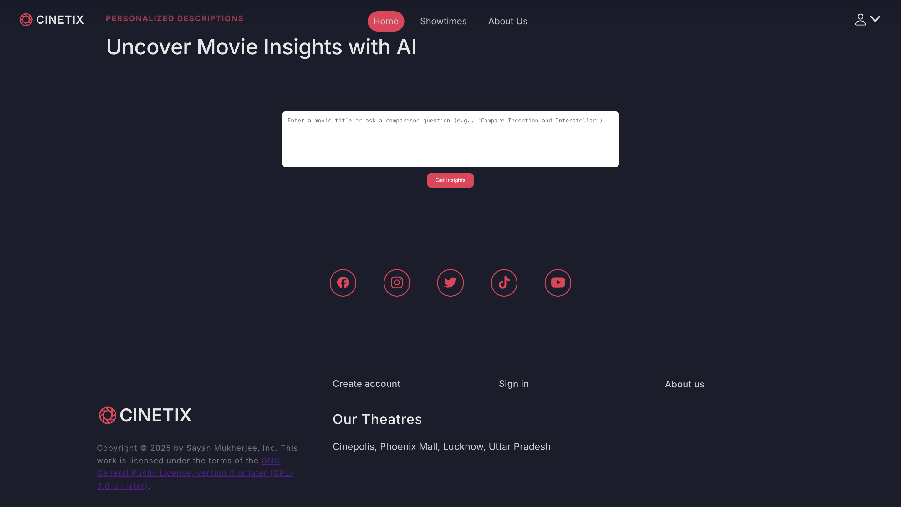

# 🎬 CineTix - Your Gateway to Enchanting Movie Magic  

  

## 📌 Overview  
CineTix is your ultimate destination for an unparalleled cinematic experience. With seamless ticket booking, personalized movie insights, and a rich selection of showtimes, we bring the magic of movies right to your fingertips. Whether you’re looking for the latest blockbusters or timeless classics, CineTix ensures a hassle-free, immersive experience for all movie lovers.  

## ✨ Features  

- **🎟️ Easy Ticket Booking**: Browse and purchase movie tickets effortlessly.  
- **📅 Showtimes & Locations**: Find movie schedules at your favorite theaters.  
- **🔍 Personalized Movie Insights**: Use AI to get detailed reviews and comparisons.  
- **🍿 Seamless Movie Experience**: Stay updated with upcoming releases and special screenings.  
- **⭐ Customer Reviews**: Read and share movie experiences with fellow enthusiasts.  
- **🎭 Theater Information**: Discover premium theater amenities near you.  

## 📸 Screenshots  

| Movie Selection | Ticket Booking |  
|----------------|---------------|  
|  |  |  
|  |  |  
|  |  |  
|  |  |  
|  |  |  
|  |  |  

## 🚀 Installation  

To set up CineTix on your local machine, follow these steps:  

### Backend Setup  

```bash
# Navigate to the backend directory
cd CineTix-API  

# Install dependencies
npm install  

# Start the backend server
node server.js  
``` 

### Frontend Setup  

```bash
# Navigate to the frontend directory
cd CineTix-FE  

# Install dependencies
npm install  

# Start the frontend application
npm run dev  
```

## 📖 Usage  

1. **Sign Up / Log In**: Create an account or sign in to access features.  
2. **Browse Showtimes**: Check movie schedules and book tickets at your preferred theater.  
3. **Discover Movie Insights**: Compare movies and get AI-powered recommendations.  
4. **Read & Write Reviews**: Share your thoughts on the latest releases.  
5. **Stay Updated**: Get notified about upcoming movies and special screenings.  


## 🔧 Tech Stack  

- **Frontend**: React.js, Tailwind CSS  
- **Backend**: Node.js, Express.js  
- **Database**: MongoDB  
- **Authentication**: JWT (JSON Web Token)  

## 📬 Contact  

📧 Email: sayan1311m@gmail.com  
🌐 Website: [CineTix](https://cinetix-swart.vercel.app)  
📍 Location: Cinepolis, Phoenix Mall, Lucknow, Uttar Pradesh  

## ⭐ Contributing  

We welcome contributions! To contribute:  

1. Fork the repository.  
2. Create a new branch.  
3. Commit your changes.  
4. Push to your fork and submit a pull request.  

## 📝 License  

This project is licensed under the GNU General Public License (GPL-3.0-or-later). See the LICENSE file for details.  

---  
_Unlock the magic of cinema with CineTix!_ 🎥✨  
